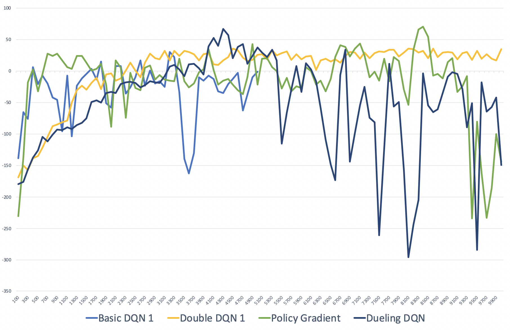

# EECS 395 - Deep Reinforcement Learning - Final Project
## Introduction and Agenda:
- Implemented four versions of Deep Q Learning on two OpenAI Gym environments
    - Basic Deep Q Learning
    - Double Deep Q Learning
    - Dueling Deep Q Learning
    - Policy Gradient
- Agenda for Video: 
    - Review each implantation along with results on Cartpole (Prove correctness)
    - Compare all four on more complex Lunar Landar Environment
    - Provide Conclusions from the Project
    
Note: Submitted Notebook has been shortened for easier reading. Full Notebook available at Github in description.

_by Rhett Dsouza, Keith Pallo and Lukas Justen_


```python
import gym
import random
import copy
import os

import pandas as pd
import numpy as np
import tensorflow as tf
import matplotlib.pyplot as plt
import shutil

from keras.models import Model
from keras.models import Sequential
from keras.models import model_from_json
from keras.layers import Dense
from keras.layers import Dropout
from keras.layers import Activation, Input
from keras.layers.core import Dense, Lambda
from keras.layers.merge import Add
from keras.losses import *
from keras.optimizers import Adam
from keras import optimizers
from keras import layers
from keras import backend as K
from keras import utils as np_utils

from IPython.display import HTML
from agent import EnvironmentAgent
from functools import partial
from collections import deque
from tensorflow.python.framework import ops
from matplotlib import gridspec
from collections import OrderedDict
```

## 1. Basic Deep Q-Learning

Lorem ipsum dolor sit amet, consectetur adipiscing elit, sed do eiusmod tempor incididunt ut labore et dolore magna aliqua. Ut enim ad minim veniam, quis nostrud exercitation ullamco laboris nisi ut aliquip ex ea commodo consequat. Duis aute irure dolor in reprehenderit in voluptate velit esse cillum dolore eu fugiat nulla pariatur. Excepteur sint occaecat cupidatat non proident, sunt in culpa qui officia deserunt mollit anim id est laborum. Lorem ipsum dolor sit amet, consectetur adipiscing elit, sed do eiusmod tempor incididunt ut labore et dolore magna aliqua. Ut enim ad minim veniam, quis nostrud exercitation ullamco laboris nisi ut aliquip ex ea commodo consequat. Duis aute irure dolor in reprehenderit in voluptate velit esse cillum dolore eu fugiat nulla pariatur. Excepteur sint occaecat cupidatat non proident, sunt in culpa qui officia deserunt mollit anim id est laborum.


#### Implementation


```python
class DeepQLearning:
  
    def __init__(self, action_size, observation_size, environment):
        '''
        Initialize all the parameters that are required for basic deep Q-Learning.

        :param action_size: The number of different actions the agent can take.
        :param observatoion_size: The number of input observations the agent gets.
        :param environment: The environment, in which the agent is living in.
        '''
        self.epsilon = 1.0
        self.epsilon_min = 0.05
        self.epsilon_decay = 0.9997
        self.gamma = 1.0
        self.learning_rate = 0.001
        self.batch_size = 512
        self.action_size = action_size
        self.observation_size = observation_size
        self.target_model = self.build_model()
        self.memory = deque(maxlen=2000)
        self.environment = environment
    
    def take_action(self, observation, train):
        '''
        Takes one action based on the given observation and the environment.

        :param observation: The current observation which the agent should act on.
        '''
        if train and np.random.rand(1) < self.epsilon:
            return self.environment.action_space.sample()
        return np.argmax(self.target_model.predict(observation)[0])
  
    def remember(self, observation, action, reward, next_observation, done):
        '''
        Takes all the parameters of the environment and stores them in a memory.

        :param observation: The current observation.
        :param action: The action the agent took based on the observation.
        :param reward: The reward the agent got for his action.
        :param next_observation: The resulting observation based on the last action.
        :param done: Is the agent done with the simulation.

        :return: The new next observation
        '''
        self.memory.append((observation, action, reward, next_observation, done))
        return next_observation
    
    def train_model(self, episode, done):
        '''
        Trains all the models that are required for this Q-Learning implementation.

        :param episode: Takes in the current episode of training.
        '''
        if len(self.memory) >= self.batch_size:
            minibatch = random.sample(self.memory, self.batch_size)
            minibatch = np.array(minibatch)
            observations = np.vstack(minibatch[:, 0])
            next_observations = np.vstack(minibatch[:,3])
            target = np.copy(minibatch[:,2])
            done_states = np.where(minibatch[:, 4] == False)
            if len(done_states[0]) > 0:
                predictions = self.target_model.predict(next_observations)
                predictions = np.amax(predictions, axis=1)
                target[done_states] += np.multiply(self.gamma, predictions[done_states])
            actions = np.array(minibatch[:, 1], dtype=int)
            target_f = self.target_model.predict(observations)
            target_f[range(self.batch_size), actions] = target
            self.target_model.fit(observations, target_f, epochs=1, verbose=0)

        if done and self.epsilon > self.epsilon_min:
            self.epsilon = self.epsilon * self.epsilon_decay
           
    def build_model(self):
        '''
        Builds the initial architecture for a basi deep Q-Learning algorithm

        :return: A new keras model for the current environment.
        '''
        model = Sequential()
        model.add(Dense(24, input_dim=self.observation_size, activation='relu'))
        model.add(Dense(24, activation='relu'))
        model.add(Dense(self.action_size, activation='linear'))
        model.compile(loss='mse', optimizer=Adam(lr=self.learning_rate))
        return model  
  
    def reset(self):
        '''
        Resets the environment to a new observation and returns the observation.

        :return: An initial observation state as well as other reset values.
        '''
        observation = self.environment.reset()
        observation = np.reshape(observation, (1, self.observation_size))
        return observation, False, 0
  
    def take_step(self, action):
        '''
        Takes step based on the specified action. This will simulate a new step. 

        :return: The results of the step the agent took
        '''
        next_observation, reward, done, info = self.environment.step(action)
        next_observation = np.reshape(next_observation, (1,self.observation_size))
        return next_observation, reward, done, info
  
    def save_models(self, prefix, folder_id):
        '''
        This function saves the model on disk and uploads all files to Google drive.

        :param prefix: A prefix for the files to be stored.
        '''
        self.target_model.save_weights(prefix + '_weights.h5')
    
    def load_weights(self, weights):
        '''
        Loads the weights for the target network based on the given input weights.
        '''
        self.target_model.load_weights(weights)
```

#### Results


## 2. Double Deep Q-Learning

Compared to the basic deep Q-Learning implementation, the only modification needed to implement Double Deep Q-Learning is to change the way how the models is trained. A big drawback of basic deep Q-Learning is that the algorithm overestimates action values under certain conditions. To mitigate that problem, one can use two networks with the exact same network architecture (proposed here: https://arxiv.org/abs/1509.06461). However, instead of updating the target network after each episode we train the second network which is called q network for several episodes. After a fixed number of episodes the target network will then be updated by copying the parameters of the q network.

One of our major findings for this implementation was that this architecture leads to more stable results. Moreover, if the algorithm stagnates at a certain reward level this implementation will likely stay at that level as opposed to dropping off. Nonetheless, this implementation also introduces the parameter for updating the target network after n episodes. This new hyperparameter increases the complexity compared to our basic q-learning implementation. Thus, for simple problems like the cart-pole environment we would recommend to use a simple q learner because tuning all the parameters can take quite a lot of time.

#### Implementation


```python
class DoubleDeepQLearning(DeepQLearning):
  
    def __init__(self, action_size, observation_size, environment):
        '''
        Initialize all the parameters that are required for double deep Q-Learning.
        Double deep q learning needs a second network and the number of epsidoes
        after the algoruthm should update the target network based on the q model.

        :param action_size: The number of different actions the agent can take.
        :param observatoion_size: The number of input observations the agent gets.
        :param environment: The environment, in which the agent is living in.
        '''
        DeepQLearning.__init__(self, action_size, observation_size, environment)
        self.q_model = self.build_model()
        self.update_target_every_episodes = 2
  
    def train_model(self, episode, done):
        '''
        Trains all the models that are required for this Q-Learning implementation.
        Compared to the basic implementation we now have two networks that interact
        with each other. The target network is only updated after n episdoes.
        '''
        if len(self.memory) >= self.batch_size:
            minibatch = random.sample(self.memory, self.batch_size)
            minibatch = np.array(minibatch)
            observations = np.vstack(minibatch[:, 0])
            next_observations = np.vstack(minibatch[:,3])
            target = np.copy(minibatch[:,2])
            done_states = np.where(minibatch[:, 4] == False)
            if len(done_states[0]) > 0:
                q_values = self.q_model.predict(next_observations)
                best_actions = np.argmax(q_values, axis=1)
                q_targets = self.target_model.predict(next_observations)
                target[done_states] += np.multiply(self.gamma, q_targets[done_states, best_actions[done_states]][0])
            actions = np.array(minibatch[:, 1], dtype=int)
            target_f = self.target_model.predict(observations)
            target_f[range(self.batch_size), actions] = target
            self.q_model.fit(observations, target_f, epochs=1, verbose=0)

        if done and self.epsilon > self.epsilon_min:
            self.epsilon = self.epsilon * self.epsilon_decay

        if done and (episode + 1) % self.update_target_every_episodes == 0:
            self.target_model.set_weights(self.q_model.get_weights())

    def load_weights(self, weights):
        '''
        Loads the weights for the target/q network based on the given input weights.
        '''
        self.target_model.load_weights(weights)
        self.q_model.load_weights(weights)
```

#### Results


## 3. Dueling Deep Q-Learning

The next step after building a double deep Q-Learning algorithm was extending the architecture to a more recent optimization, which is a dueling network. Our implementation first inherits all the functions of the double deep q learner.

The only thing that we need to change is the “build_model” function. In Dueling Deep Q-learning (as shown in the image below) two streams or branches perform different purposes - one is called the advantage branch and the other is called the Value branch. Each branch takes the observations of the environment as an input. The advantage branch then calculates the q values for all the actions while the value branch tries to model the reward landscape. The value branch by contract models the state value, V. By separating these two calculations each network can fit the desired landscape much better.

Since this algorithm inherits from our double deep Q-Learning implementation we also have two copies of the network.


#### Implementation


```python
class DuelingDeepQLearning(DoubleDeepQLearning):
  
    def __init__(self, action_size, observation_size, environment):
        '''
        Initialize all the parameters that are required for dueling deep Q-Learning.

        :param action_size: The number of different actions the agent can take.
        :param observatoion_size: The number of input observations the agent gets.
        :param environment: The environment, in which the agent is living in.
        '''
        DoubleDeepQLearning.__init__(self,action_size,observation_size, environment)
  
    def build_model(self):
        '''
        Builds the initial architecture for the dueling deep q learning algorithm. 
        The actual training does not change but only the way how we compose the 
        network. Changing this function is the only change compared to double Q-L.

        :return: A new keras model for the current environment.
        '''
        inputs = Input(shape=(self.observation_size,))

        advt = Dense(64, activation='relu')(inputs)
        advt = Dense(64, activation='relu')(advt)
        advt = Dense(64, activation='relu')(advt)
        advt = Dense(self.action_size)(advt)

        value = Dense(16, activation='relu')(inputs)
        value = Dense(16, activation='relu')(value)
        value = Dense(1)(value)

        advt = Lambda(lambda advt: advt - tf.reduce_mean(advt, axis=1, keep_dims=True))(advt)
        value = Lambda(lambda value: tf.tile(value, [1, self.action_size]))(value)

        final = Add()([value, advt])
        model = Model(inputs = inputs, outputs = final)

        model.compile(loss='mse', optimizer=Adam(lr=self.learning_rate))

        return model
```

#### Results


## 4. Policy Gradient Learning

Policy Gradient applies a different mindset when deciding what actions to take. Rather than learning (regressing) the optimal Q-values associated with a next best action (like in the other DQN algorithms), Policy Gradient attempts to directly generate the next action as a classifiction task following the Markov property, using a softmax operation in the last layer of the network. For this case, to encorporate the reward structure, each step of the optimizer is weighted by the cumulative reward of the future actions in the episode. 

This was much harder to implement with the Keras API, as it involved changing the fundamental loss function supplied to the model compilation of Keras. Instead, we opted to use a Tensorflow implementation, that very easily configures the loss function based on how you wish to supply the weighting.

Judging from the plots, it appears that Policy Gradient in this context is very erratic in its training. It is able to achieve extremely high average rewards compared to the other Deep Q-learning algorithms, but has no stability to its training curve. This results in a lower reliability on the reward capability of Policy Gradient. Random dropping of the average reward result value, even after the network appears to be performing optimally, requires the weights to be cherry-picked (we opted not to do so, hence the videos represent sub-optimal models) hinting at the idea that the network may not be easily generalisable to newer situations of similar environments.

#### Implementation


```python
class PolicyGradient:
  
    def __init__(self, n_y, n_x, environment, learning_rate=0.01, reward_decay=0.95, load_path=None, save_path=None): 
        '''
        Initialize all the parameters that are required for policy gradient learning.

        :param n_y: The number of different actions the agent can take.
        :param n_x: The number of input observations the agent gets.
        :param environment: The environment, in which the agent is living in.
        '''
        self.n_x = n_x
        self.n_y = n_y
        self.environment = environment
        self.lr = learning_rate
        self.gamma = reward_decay

        self.save_path = None
        if save_path is not None:
            self.save_path = save_path

        self.episode_observations, self.episode_actions, self.episode_rewards = [], [], []
        self.build_model()
        self.cost_history = []
        self.sess = tf.Session()
        tf.summary.FileWriter("logs/", self.sess.graph)
        self.sess.run(tf.global_variables_initializer())
        self.saver = tf.train.Saver()

        if load_path is not None:
            self.load_path = load_path
            self.saver.restore(self.sess, self.load_path)
    
    def reset(self):
        '''
        Resets the environment to a new observation and returns the observation.

        :return: An initial observation state as well as other reset values.
        '''
        observation = self.environment.reset()
        observation = np.reshape(observation, (1, self.n_x))
        return observation, False, 0
  
    def remember(self, s, a, r, ns, done):
        """
        Store play memory for training.
        
        :param s: observation
        :param a: action taken
        :param r: reward after action
        """
        self.episode_observations.append(s[0])
        self.episode_rewards.append(r)

        action = np.zeros(self.n_y)
        action[a] = 1
        self.episode_actions.append(action)
        return ns

    def take_action(self, observation, train):
        """
        Choose action based on observation.
        
        :param observation: array of state, has shape (num_features)
            :return: index of action we want to choose
        """

        observation = np.asarray(np.asarray(observation).T)
        # Run forward propagation to get softmax probabilities
        prob_weights = self.sess.run(self.outputs_softmax, feed_dict = {self.X: observation})

        # Select action using a biased sample this will return the index of the action we've sampled
        action = np.random.choice(range(len(prob_weights.ravel())), p=prob_weights.ravel())
        return action
           
    def take_step(self, action):
        '''
        Takes a step based on the specified action. In fact, this will simulate a new step. 

        :return: The results of the step the agent took
        '''
        next_observation, reward, done, info = self.environment.step(action)
        next_observation = np.reshape(next_observation, (1,self.n_x))
        return next_observation, reward, done, info
       
    def train_model(self,e, done):
        # Discount and normalize episode reward
        discounted_episode_rewards_norm = self.discount_and_norm_rewards()

        # Train on episode
        self.sess.run(self.train_op, feed_dict={
             self.X: np.vstack(self.episode_observations).T,
             self.Y: np.vstack(np.array(self.episode_actions)).T,
             self.discounted_episode_rewards_norm: discounted_episode_rewards_norm,
        })

        # Reset the episode data
        self.episode_observations, self.episode_actions, self.episode_rewards  = [], [], []

        return discounted_episode_rewards_norm
      
    def discount_and_norm_rewards(self):
        discounted_episode_rewards = np.zeros_like(self.episode_rewards)
        cumulative = 0
        for t in reversed(range(len(self.episode_rewards))):
            cumulative = cumulative * self.gamma + self.episode_rewards[t]
            discounted_episode_rewards[t] = cumulative

        discounted_episode_rewards -= np.mean(discounted_episode_rewards)
        discounted_episode_rewards /= np.std(discounted_episode_rewards)
        return discounted_episode_rewards

    def build_model(self):
        # Create placeholders
        tf.reset_default_graph()
        with tf.name_scope('inputs'):
            self.X = tf.placeholder(tf.float32, shape=(self.n_x, None), name="X")
            self.Y = tf.placeholder(tf.float32, shape=(self.n_y, None), name="Y")
            self.discounted_episode_rewards_norm = tf.placeholder(tf.float32, [None, ], name="actions_value")

        # Initialize parameters
        units_layer_1 = 24
        units_layer_2 = 24
        units_output_layer = self.n_y
        with tf.name_scope('parameters'):
            W1 = tf.get_variable("W1", [units_layer_1, self.n_x], initializer = tf.contrib.layers.xavier_initializer(seed=1))
            b1 = tf.get_variable("b1", [units_layer_1, 1], initializer = tf.contrib.layers.xavier_initializer(seed=1))
            W2 = tf.get_variable("W2", [units_layer_2, units_layer_1], initializer = tf.contrib.layers.xavier_initializer(seed=1))
            b2 = tf.get_variable("b2", [units_layer_2, 1], initializer = tf.contrib.layers.xavier_initializer(seed=1))
            W3 = tf.get_variable("W3", [self.n_y, units_layer_2], initializer = tf.contrib.layers.xavier_initializer(seed=1))
            b3 = tf.get_variable("b3", [self.n_y, 1], initializer = tf.contrib.layers.xavier_initializer(seed=1))

        # Forward prop
        with tf.name_scope('layer_1'):
            Z1 = tf.add(tf.matmul(W1,self.X), b1)
            A1 = tf.nn.relu(Z1)
        with tf.name_scope('layer_2'):
            Z2 = tf.add(tf.matmul(W2, A1), b2)
            A2 = tf.nn.relu(Z2)
        with tf.name_scope('layer_3'):
            Z3 = tf.add(tf.matmul(W3, A2), b3)
            A3 = tf.nn.softmax(Z3)

        # Softmax outputs, we need to transpose as tensorflow nn functions expects them in this shape
        logits = tf.transpose(Z3)
        labels = tf.transpose(self.Y)
        self.outputs_softmax = tf.nn.softmax(logits, name='A3')

        with tf.name_scope('loss'):
            neg_log_prob = tf.nn.softmax_cross_entropy_with_logits(logits=logits, labels=labels)
            loss = tf.reduce_mean(neg_log_prob * self.discounted_episode_rewards_norm)  # reward guided loss

        with tf.name_scope('train'):
            self.train_op = tf.train.AdamOptimizer(self.lr).minimize(loss)
    
    def close_policy(self):
        self.sess.close()
      
    def save_models(self, prefix, folder_id):
        self.save_path = prefix + '/model_weights'
        save_path = self.saver.save(self.sess, self.save_path)
        print("Model saved in file: %s" % save_path)
        shutil.make_archive(prefix, 'zip', prefix)
```

## Cart Pole Results


```python
HTML("""<video width='974' height='824' controls><source src='cart_pole_all_trimmed.mov'></video> """)
```


<video width='974' height='824' controls><source src='cart_pole_all_trimmed.mov'></video> 


## Lunar Lander Results





```python
HTML("""<video width='974' height='824' controls><source src='lunar_landar_all_trimmed.mov'></video> """)
```


<video width='974' height='824' controls><source src='lunar_landar_all_trimmed.mov'></video> 


## Conclusion
- It is difficult to tell which version of Deep Q Learning will work best on agiven problem

- Learned policies can change drastically over time, and behavior can deviate from settings that were previously superior in performance

- There are a significant number of tuning parameters which are highly sensitive and there is often less intuition than standard deep learning parameter tuning

- State of the art Reinforcement algorithms present an excellent way to solve extremely challenging problems, but it is critical that they are one of the last solutions considered at it is a daunting task to implement them correctly. The algorithms shown here are simply a tool, where the real work is often in creating the environment and moreimportantly the reward structure

# (A) Appendix
## Network Architectures
Lorem ipsum dolor sit amet, consectetur adipiscing elit, sed do eiusmod tempor incididunt ut labore et dolore magna aliqua. Ut enim ad minim veniam, quis nostrud exercitation ullamco laboris nisi ut aliquip ex ea commodo consequat. Duis aute irure dolor in reprehenderit in voluptate velit esse cillum dolore eu fugiat nulla pariatur. Excepteur sint occaecat cupidatat non proident, sunt in culpa qui officia deserunt mollit anim id est laborum. Lorem ipsum dolor sit amet, consectetur adipiscing elit, sed do eiusmod tempor incididunt ut labore et dolore magna aliqua. Ut enim ad minim veniam, quis nostrud exercitation ullamco laboris nisi ut aliquip ex ea commodo consequat. Duis aute irure dolor in reprehenderit in voluptate velit esse cillum dolore eu fugiat nulla pariatur. Excepteur sint occaecat cupidatat non proident, sunt in culpa qui officia deserunt mollit anim id est laborum.

Cart Pole:
- Basic DQN:       4 x 64 x 64 x 2
- Double DQN:      4 x 24 x 24 x 2
- Dueling DQN:     4 x 24 x 24 x 2 + 4 x 24 x 24 x 2
- Policy Gradient: 4 x 24 x 24 x 2

Lunar Lander:

- Basic DQN:   8 x 24 x 24 x 4
- Double DQN:  8 x 512 x 512 x 512 x 4
- Dueling DQN: 8 x 64 x 64 x 64 x 4 + 8 x 16 x 16 x 4
- Policy Gradient: 4 x 24 x 24 x 2

## Simulating Results

__Note:__ uou might need to change the network architecture in the implementation above. As of now only the Policy Gradient, Dueling, and basic implementation will work.


```python
environment = gym.make("LunarLander-v2")
basicDeepQLearner = DeepQLearning(4, 8, environment)
agent = EnvironmentAgent(environment, basicDeepQLearner, weights='./lunar_lander/basic_deep_q_learner_weights.h5')
agent.train_agent(train=False)
agent.close_environment()
```


```python
environment = gym.make("LunarLander-v2")
doubleDeepQLearner = DoubleDeepQLearning(4, 8, environment)
agent = EnvironmentAgent(environment, doubleDeepQLearner, weights='./lunar_lander/double_deep_q_learner_weights.h5')
agent.train_agent(train=False)
agent.close_environment()
```


```python
environment = gym.make("LunarLander-v2")
duelingDeepQLearner = DuelingDeepQLearning(4, 8, environment)
agent = EnvironmentAgent(environment, duelingDeepQLearner, weights='./lunar_lander/dueling_deep_q_learner_weights.h5')
agent.train_agent(train=False)
agent.close_environment()
```


```python
environment = gym.make("LunarLander-v2")
policyGradientLearner = PolicyGradient(4, 8, environment, load_path='./lunar_lander/policy_gradient_weights/model_weights')
agent = EnvironmentAgent(environment, policyGradientLearner)
agent.train_agent(train=False)
agent.close_environment()
```
